### EX-06-Feature-Transformation

## AIM:
To Perform the various feature transformation techniques on a dataset and save the data to a file.

## Explanation:
Feature Transformation is a mathematical transformation in which we apply a mathematical formula to a particular column(feature) and transform the values which are useful for our further analysis.

## ALGORITHM:

Step 1:
Read the given Data

Step 2:
Clean the Data Set using Data Cleaning Process

Step 3:
Apply Feature Transformation techniques to all the feature of the data set

Step 4:
Save the data to the file.

```
##CODE:
Developed By : DHANUSH S
Register Number : 212221230020
````
````
 Titanic Dataset:
import pandas as pd
import numpy as np
import scipy.stats as stats
import seaborn as sns
import matplotlib.pyplot as plt
import statsmodels.api as sm

df=pd.read_csv("titanic_dataset.csv")
df.info()

df.isnull().sum()

df['Cabin']=df['Cabin'].fillna(df['Cabin'].mode()[0])
df['Age']=df['Age'].fillna(df['Age'].mean())
df['Embarked']=df['Embarked'].fillna(df['Embarked'].mode()[0])
df.isnull().sum()

df.skew()
df1=df.copy()
df1=df.info()
df1.skew()
df1["Sibsp_1"]=np.sqrt(df1.SibSp)
df1.SibSp.hist()
df1.skew()
df

del df['Name']
df

del df['Cabin']
del df['Ticket']
df.isnull().sum()

from sklearn.preprocessing import
OrdinalEncoder
embark=["C","S","Q"]
emb=OrdinalEncoder (categories =[embark])
df["Embarked"]=emb.fit_transform(df[["Embarked"]])
df

from category_encoders import BinaryEncoder
be1=BinaryEncoder()
df['Sex']=be1.fit_transform(df[["Sex"]])
df


#Function Transformation:
#Log Tranformation:
np.log(df["Age"])

#Reciprocal Transformation
np.reciprocal (df[["Fare"]])

#sqrt transformation
np.sqrt(df["Embarked"])

#power transformation
df["Age_boxcox"],parameters=stats.boxcox(df["Age"])
df


df["Pclass_boxcox"],parameters=stats.boxcox(df["Pclass"])
df

df["Fare_yeojohnson"],parameters = stats.yeojohnson(df["Fare"])
df

df["Parch_yeojohnson"],parameters = stats.yeojohnson(df["Parch"])
df

df.skew()

#Quantile transformation

from sklearn.preprocessing import QuantileTransformer

qt=QuantileTransformer(output_distribution ='normal',n_quantiles=891)

df["Age_1"]=qt.fit_transform(df[["Age"]])
sm.qqplot(df['Age'],line='45')

sm.qqplot(df['Age_1'],line='45')

df["Fare_1"]=qt.fit_transform(df[["Fare"]])
sm.qqplot(df["Fare"],line='45')
sm.qqplot(df['Fare_1'],line='45')

df["Parch_1"]=qt.fit_transform(df[["Parch"]])
sm.qqplot(df['Parch'],line='45')
sm.qqplot(df['Parch_1'],line='45')

df
```
````
  Data to transform:

import pandas as pd
import numpy as np
import scipy.stats as stats
import seaborn as sns
import matplotlib.pyplot as plt
import statsmodels.api as sm

df=pd.read_csv("Data_To_Transform.csv")
df

df.skew()

#Function Transformation 
#Log Transformation 
np.log(df["Highly Positive Skew"])
np.reciprocal(df["Moderate Positive Skew"])
np.sqrt(df["Highly Positive Skew"])

df["Highly positive Skew_boxcox"],parameters=stats.boxcox(df["Highly Positive Skew"])

df["Moderate Positive Skew_yeojohnson"],parameters=stats.boxcox(df["Moderate Positive Skew"])
df

df["Moderate Negative Skew_yeojohnson"],parameters=stats.yeojohnson(df["Moderate Negative Skew"])
df


df["Highly Negative Skew_yeojohnson"],parameters=stats.yeojohnson(df["Highly Negative Skew"])
df

df.skew()
#Quantile Transformation 
from sklearn.preprocessing import QuantileTransformer
qt=QuantileTransformer(output_distribution ='normal')

df["Moderate Negative Skew_1"]=qt.fit_transform(df[["Moderate Negative Skew"]])
sm.qqplot(df["Moderate Negative Skew"],line='45')

df["Highly Negative Skew_1"]=qt.fit_transform(df[["Highly Negative Skew"]])
sm.qqplot(df["Highly Negative Skew"],line='45')

df["Highly Positive Skew_1"]=qt.fit_transform(df[["Highly Positive Skew"]])
sm.qqplot(df["Highly Positive Skew"],line='45')

df
````
# OUPUT:
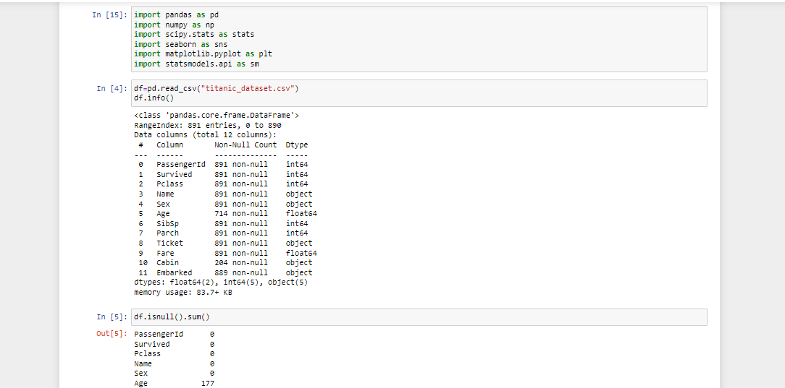
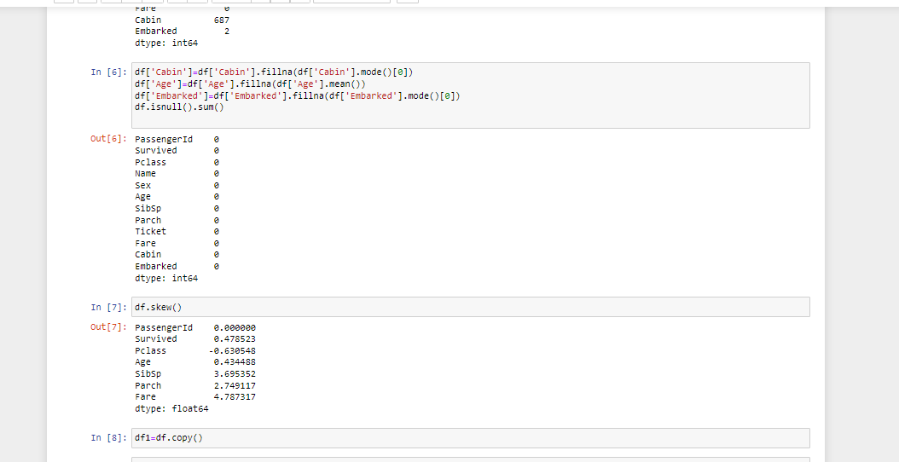

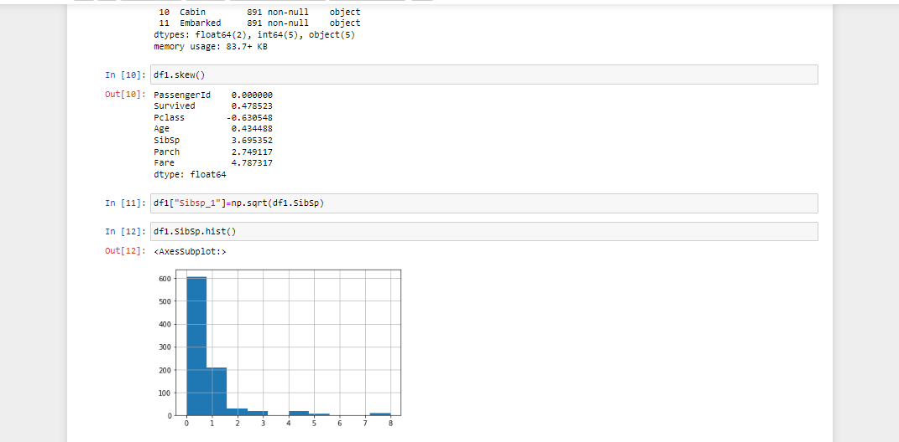
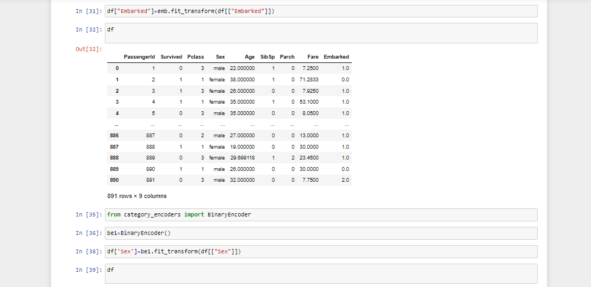
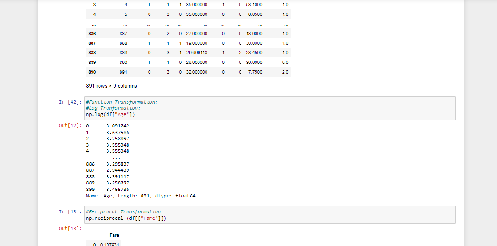
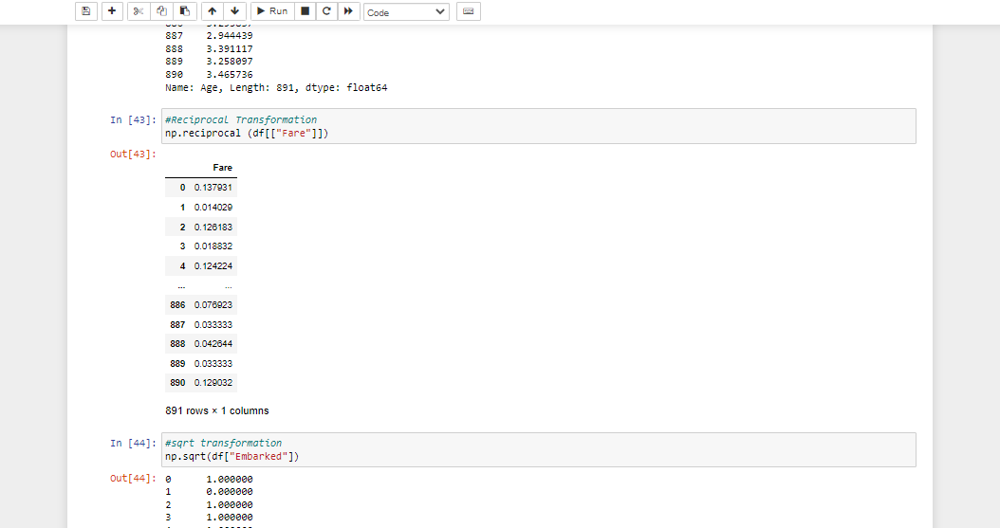
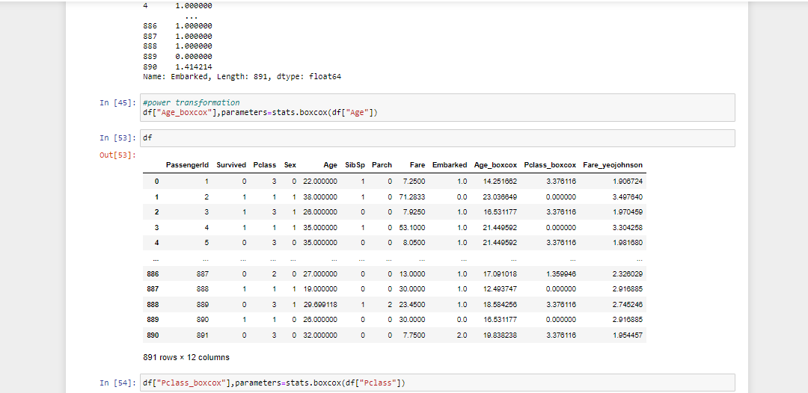
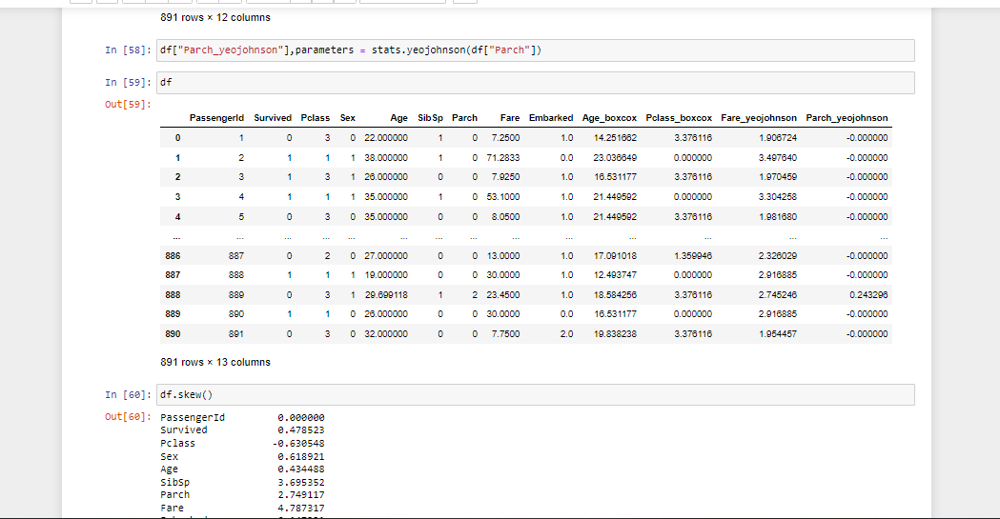

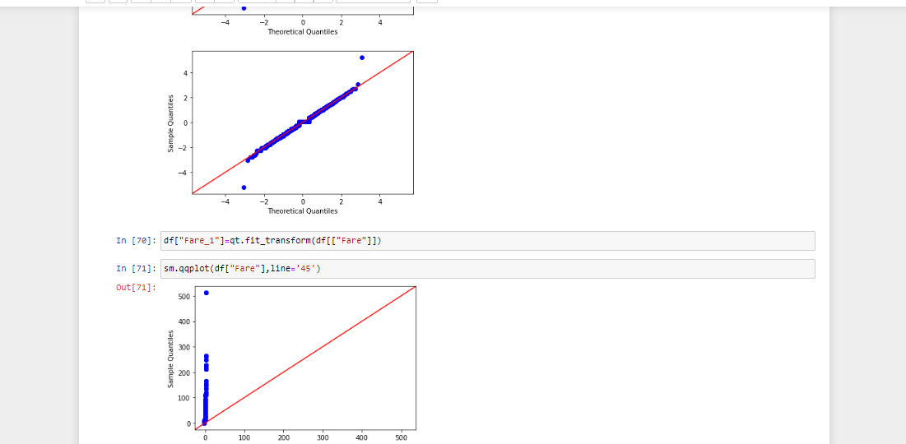
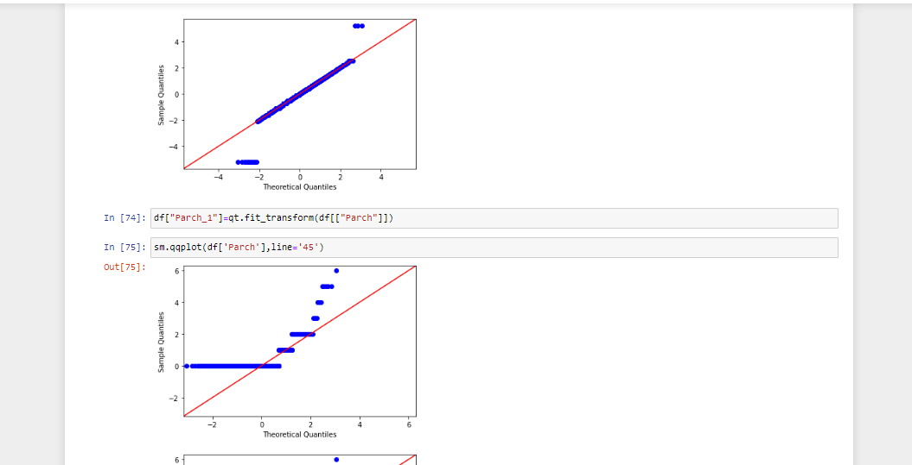
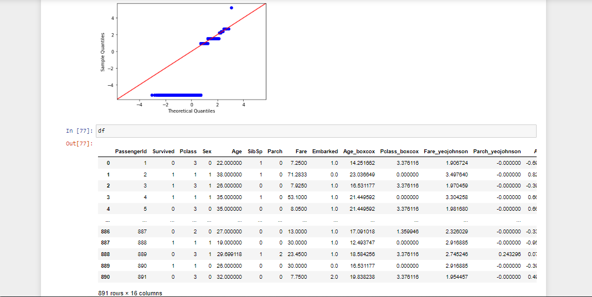
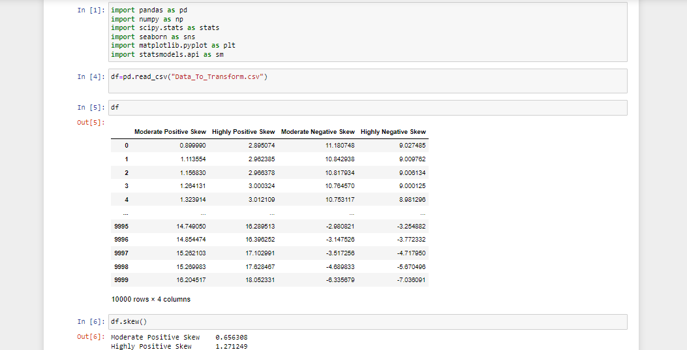
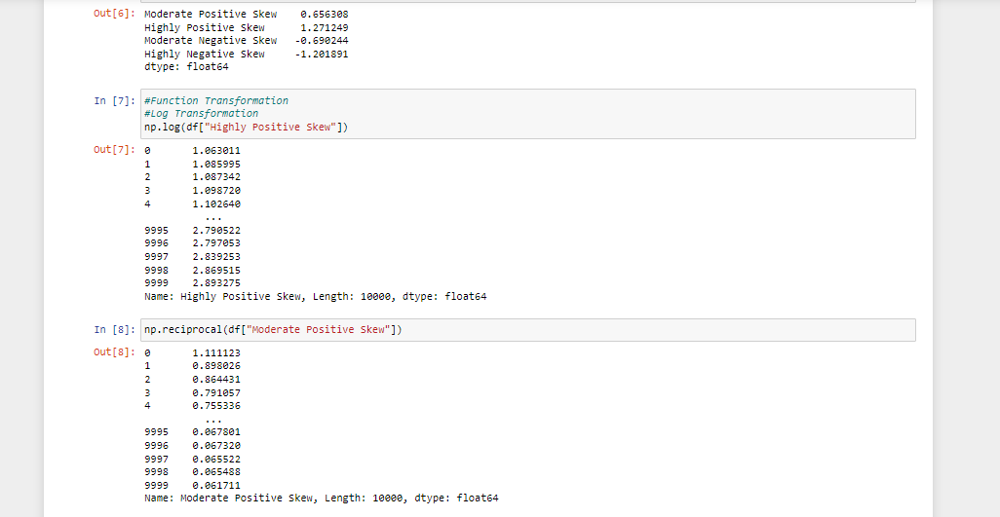
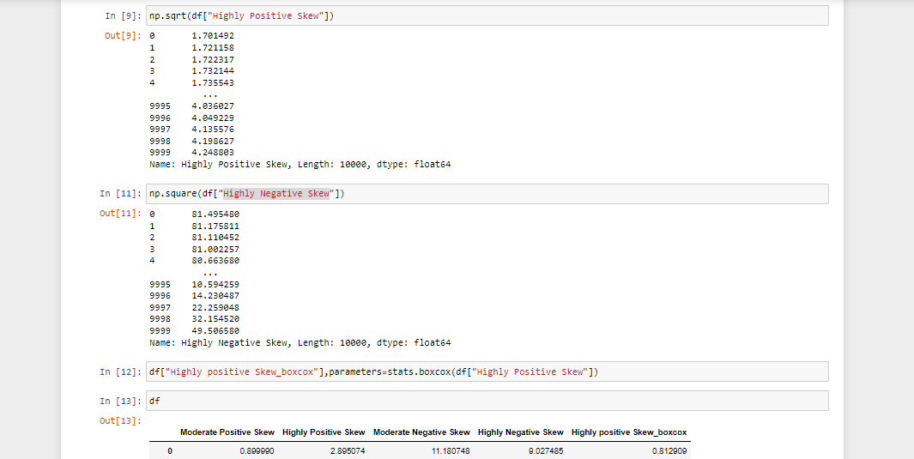
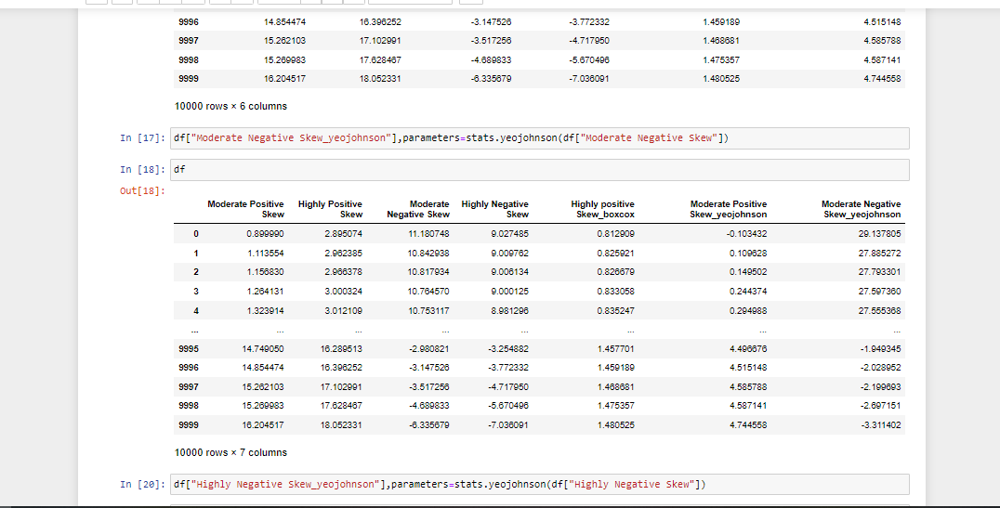

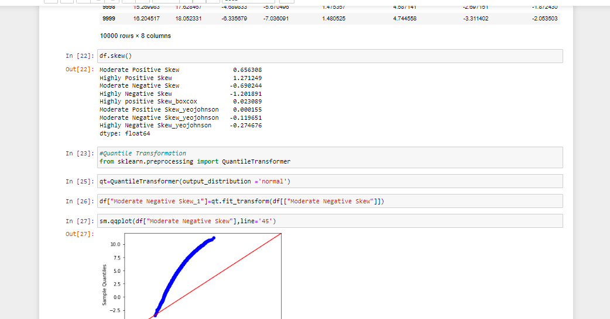
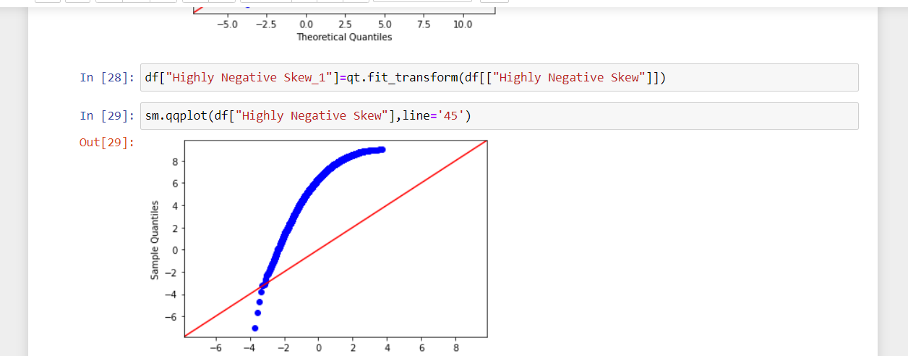
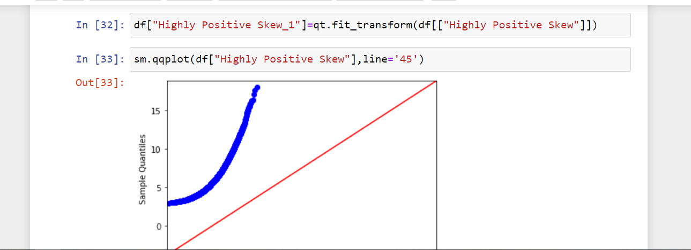


# Result:
The various feature transformation techniques on a dataset and save the data to a file has been performed successfully.
